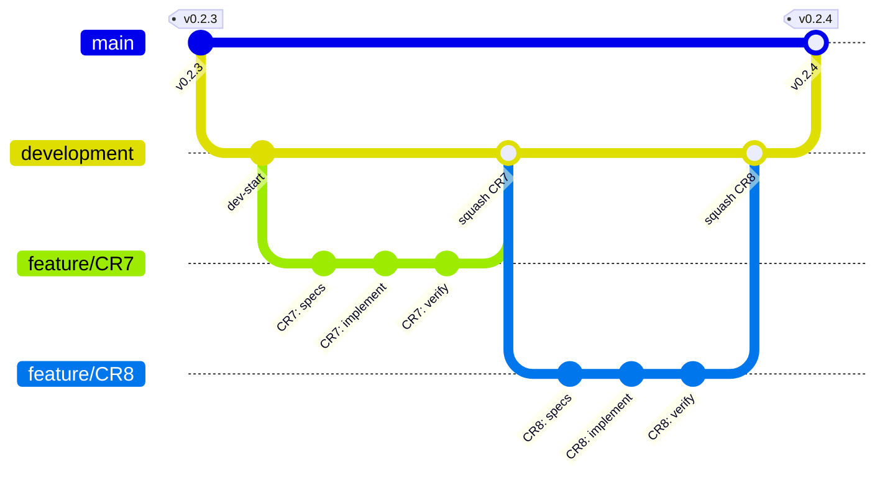

# Skill: Git Branching Strategy & Commit Conventions

> **Implements**: SYSP_SPEC_SKILL_BRANCHING_STRATEGY, SYSP_SPEC_SKILL_BRANCHING_PERMISSIONS, SYSP_SPEC_SKILL_BRANCHING_COMMIT_CONVENTIONS
> **Requirements**: SYSP_REQ_SKILL_BRANCHING_CHAINED, SYSP_REQ_SKILL_BRANCHING_MAIN_PROTECTION, SYSP_REQ_SKILL_BRANCHING_NAMING

## Instructions

## HARD RULE

**ONLY `@syspilot.release` may commit to, merge to, or push to `main`. No exceptions.**

If you are on `main` and need to make any change, create `feature/<name>` first.
Main always equals the latest release — any non-release commit on main is a violation.

## Development Branch Strategy

syspilot uses a permanent `development` integration branch with short-lived feature branches:

**Workflow Sequence:**

1. `@syspilot.design` creates `feature/<name>` from `development`
2. `@syspilot.implement` commits code on the same branch
3. `@syspilot.verify` commits validation report on the same branch
4. `@syspilot.docu` commits documentation updates on the same branch
5. Completed feature branch is squash-merged into `development`
6. `@syspilot.release` prepares on `development` (archive, version bump, release notes, validate, commit+push), then squash-merges `development` into `main`, tags, and back-merges `main` into `development`

**Key Properties:**

- One branch per change — isolates each change for independent review
- `development` as integration target — all features merge here
- Squash-merge everywhere — clean history on `development` and `main`
- Main = releases only — main always equals the latest release
- Tag on main — `v{version}` tags mark published releases
- Back-merge after release — `git checkout development && git merge main` prevents conflicts on next release
- Conflict guidance — squash-merge conflicts resolve with `-X theirs` (development wins)

## Branch Permissions

| Agent | May create | May commit to |
|-------|-----------|--------------|
| `@syspilot.release` | (none) | `main` (squash merge from `development` + tag); `development` (prep + back-merge) |
| `@syspilot.design` | `feature/<name>` | `feature/<name>` (the branch it created) |
| `@syspilot.setup` | `update/v{version}` | `update/v{version}` (the branch it created) |
| `@syspilot.implement` | (none) | current feature branch |
| `@syspilot.verify` | (none) | current feature branch |
| `@syspilot.docu` | (none) | current feature branch |
| All other engineers | (none) | current feature branch |

`development` is a permanent branch that all feature branches merge into. No agent creates `development` — it exists permanently.

## Branch Naming Conventions

| Pattern | Created by | Purpose |
|---------|-----------|---------|
| `development` | (permanent) | Integration branch, all features merge here |
| `feature/<name>` | `@syspilot.design` | Feature work, fixes, refactors |
| `update/v{version}` | `@syspilot.setup` | Framework update branches |
| `main` | (protected) | Release-only, always latest release |

## Commit Message Conventions

Format: `<type>: <short description>`

| Type | When to use | Example |
|------|------------|---------|
| `feat` | New feature or specification | `feat: add branching skill RST specs` |
| `fix` | Bug fix or correction | `fix: correct traceability link in REQ_123` |
| `docs` | Documentation changes (non-spec) | `docs: update PM context with CR5 status` |
| `chore` | Maintenance, cleanup, tooling | `chore: archive v0.2.2 change documents` |
| `refactor` | Restructuring without behavior change | `refactor: reorganize index.rst toctrees` |

**Rules:**

- Type is lowercase
- Description is lowercase, no period at end
- Keep description under 72 characters
- Reference spec IDs in description when relevant

## Rules

* MUST NOT commit to, merge to, or push to `main` — only `@syspilot.release` may. No exceptions.
* Commit type MUST be lowercase.
* Commit description MUST be lowercase with no trailing period.
* Commit description MUST be ≤ 72 characters.
* Reference spec IDs in description when relevant.
